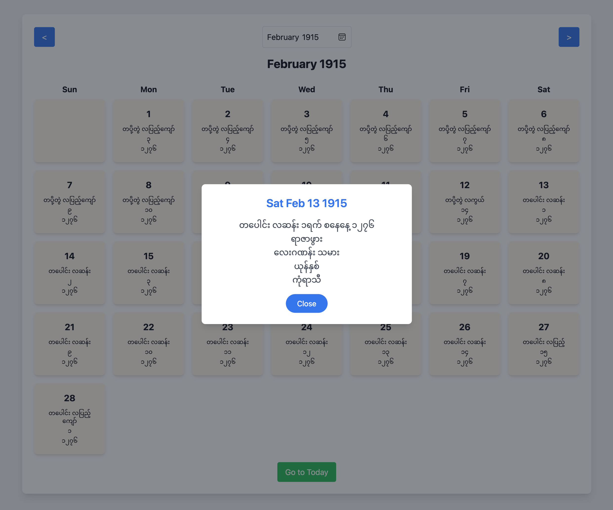

# [simple-mycal-html](https://aungmyokyaw.github.io/simple-mycal-html/)

> A premium Myanmar Calendar PWA featuring traditional lunar calendar conversion with modern design excellence


## Live

[aungmyokyaw.github.io/simple-mycal-html/](https://aungmyokyaw.github.io/simple-mycal-html/)

## Features

### Design & Aesthetics
- **Premium Neo-Traditional Luxury Theme** inspired by Myanmar gemstones (ruby, sapphire, jade, gold)
- **Glassmorphism UI** with backdrop blur and elegant borders
- **Animated Background Mesh** with subtle color shifts
- **Grain Texture Overlay** for depth and richness
- **Premium Typography** - Crimson Pro (serif), DM Sans (sans-serif), Cormorant Garamond
- **Parallax Mouse Effect** for immersive interaction
- **Responsive Design** - Ultra-wide (280px) to 4K displays with extensive breakpoints

### Calendar Functionality
- **Myanmar Date Conversion** using the [mycal](https://github.com/AungMyoKyaw/mycal) library (ES modules)
- **Traditional Calendar Details**:
  - Myanmar month and day
  - Maharbote (birth sign)
  - Numerology (Burmese numerology system)
  - Chinese Zodiac
  - Western Zodiac
- **Public Holidays** with visual indicators
- **Date Range**: 1885 to current year + 100

### Navigation & Interaction
- **Month/Year Pickers** with dropdown menus and modals
- **Keyboard Shortcuts**:
  - `←` / `→` - Navigate months
  - `Home` - Return to today
  - `Ctrl+J` - Jump to date
  - `/` - Search dates
  - `Ctrl+P` - Print calendar
  - `Escape` - Close modals
- **Swipe Gestures** - Swipe left/right on mobile to navigate
- **Jump to Date** - Navigate to any specific date
- **Search** - Find Myanmar dates by month, day, or festival name
- **Click Any Date** - View detailed Myanmar calendar information

### Progressive Web App (PWA)
- **Installable** - Add to home screen on mobile and desktop
- **Offline Support** - Works without internet connection
- **Standalone Mode** - Runs in a dedicated window like a native app
- **Service Worker** - Caches resources for offline functionality

### Additional Features
- **Share Calendar** - Copy link or use native share API
- **Print Friendly** - Optimized print stylesheet
- **URL Parameters** - Share calendar views with `?year=2025&month=1`
- **Local Storage** - Saves user preferences
- **Confetti Effect** - Special celebration when clicking today's date
- **Toast Notifications** - Elegant feedback system
- **Premium Loading Screen** - Animated gemstone spinner

## Screenshots



## Technology Stack

- **HTML5** - Single-page application
- **Tailwind CSS** - Utility-first CSS framework (via CDN)
- **Vanilla JavaScript** - ES modules, no framework dependencies
- **mycal Library** - Myanmar calendar conversion (via unpkg CDN)

## Browser Support

- Chrome/Edge (recommended)
- Firefox
- Safari
- Mobile browsers (iOS Safari, Chrome Mobile)

## Development

```bash
# Clone repository
git clone https://github.com/AungMyokyaw/simple-mycal-html.git

# Open in browser
open simple-mycal.html
```

## Calendar Library

[mycal](https://github.com/AungMyoKyaw/mycal) - Myanmar calendar conversion library

## License

MIT © [Aung Myo Kyaw](https://github.com/AungMyoKyaw)
